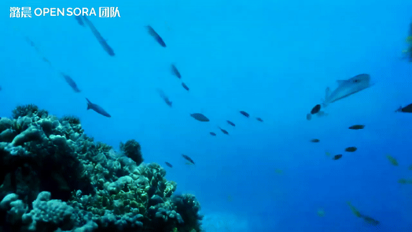
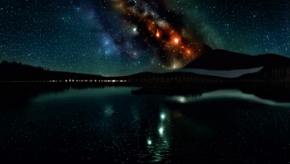
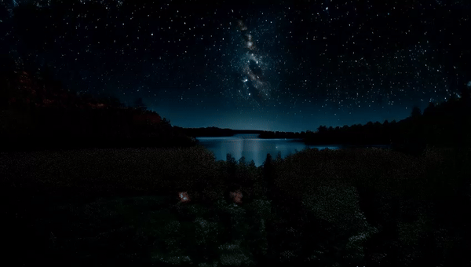
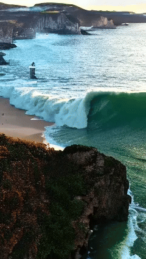
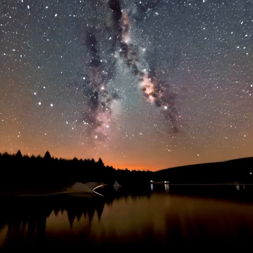
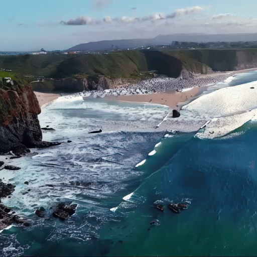
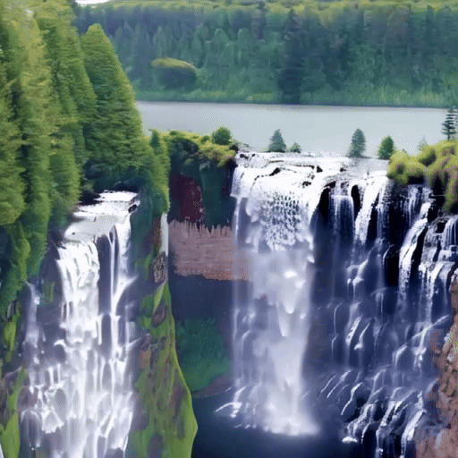
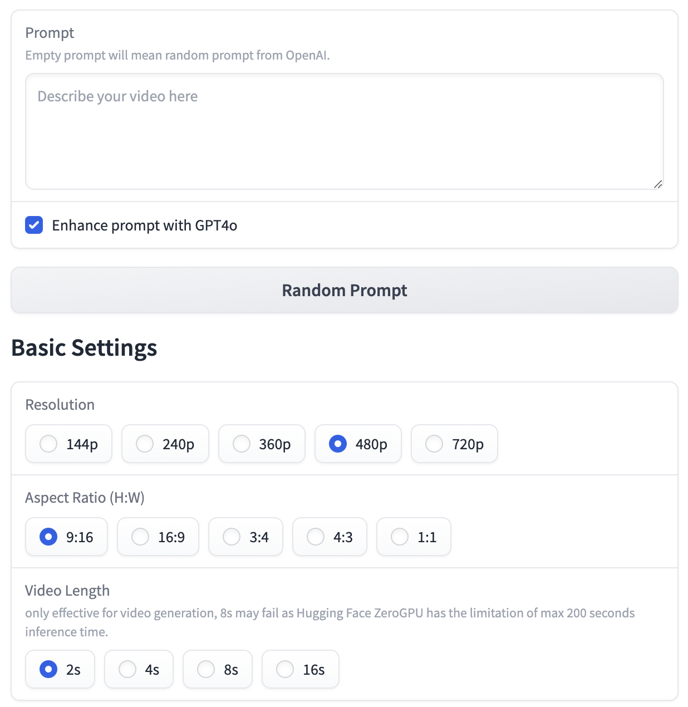
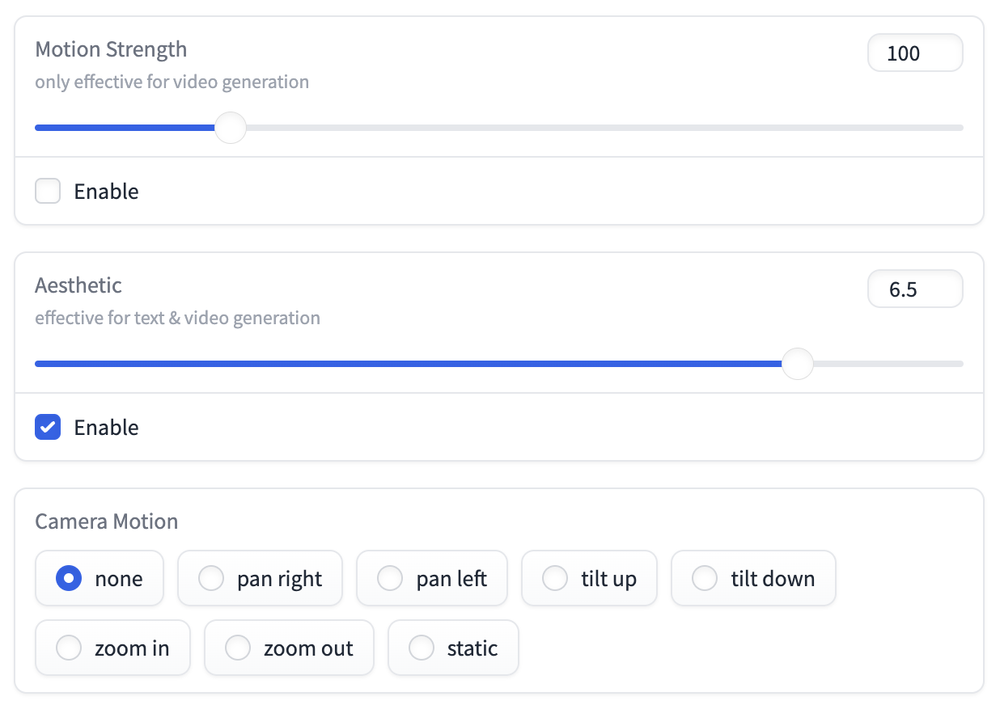
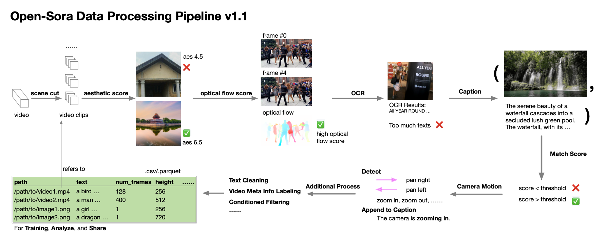

<p align="center">
    
</p>
<div align="center">
    <a href="https://github.com/hpcaitech/Open-Sora/stargazers"></a>
    <a href="https://hpcaitech.github.io/Open-Sora/"></a>
    <a href="https://discord.gg/kZakZzrSUT"></a>
    <a href="https://join.slack.com/t/colossalaiworkspace/shared_invite/zt-247ipg9fk-KRRYmUl~u2ll2637WRURVA"></a>
    <a href="https://twitter.com/yangyou1991/status/1769411544083996787?s=61&t=jT0Dsx2d-MS5vS9rNM5e5g"></a>
    <a href="https://raw.githubusercontent.com/hpcaitech/public_assets/main/colossalai/img/WeChat.png"></a>
    <a href="https://hpc-ai.com/blog/open-sora-v1.0"></a>
    <a href="https://huggingface.co/spaces/hpcai-tech/open-sora"></a>
</div>

## Open-Sora: Democratizing Efficient Video Production for All

We design and implement **Open-Sora**, an initiative dedicated to **efficiently** producing high-quality video. We hope to make the model,
tools and all details accessible to all. By embracing **open-source** principles,
Open-Sora not only democratizes access to advanced video generation techniques, but also offers a
streamlined and user-friendly platform that simplifies the complexities of video generation.
With Open-Sora, our goal is to foster innovation, creativity, and inclusivity within the field of content creation.

[[中文文档](/docs/zh_CN/README.md)] [[潞晨云](https://cloud.luchentech.com/)|[OpenSora镜像](https://cloud.luchentech.com/doc/docs/image/open-sora/)|[视频教程](https://www.bilibili.com/video/BV1ow4m1e7PX/?vd_source=c6b752764cd36ff0e535a768e35d98d2)]

<div align="center">
   <a href="https://hpc-ai.com/?utm_source=github&utm_medium=social&utm_campaign=promotion-opensora">
   
   </a>
</div>
## 📰 News

- **[2024.12.23]** 🔥 [The development cost of video generation models has saved by 50%! Open-source solutions are now available with H200 GPU vouchers](https://company.hpc-ai.com/blog/the-development-cost-of-video-generation-models-has-saved-by-50-open-source-solutions-are-now-available-with-h200-gpu-vouchers) [[code]](https://github.com/hpcaitech/Open-Sora/blob/main/scripts/train.py) [[vouchers]](https://colossalai.org/zh-Hans/docs/get_started/bonus/)
- **[2024.06.17]** 🔥 We released **Open-Sora 1.2**, which includes **3D-VAE**, **rectified flow**, and **score condition**. The video quality is greatly improved. [[checkpoints]](#open-sora-10-model-weights) [[report]](/docs/report_03.md)   [[blog]](https://hpc-ai.com/blog/open-sora-from-hpc-ai-tech-team-continues-open-source-generate-any-16-second-720p-hd-video-with-one-click-model-weights-ready-to-use)
- **[2024.04.25]** 🤗 We released the [Gradio demo for Open-Sora](https://huggingface.co/spaces/hpcai-tech/open-sora) on Hugging Face Spaces.
- **[2024.04.25]** We released **Open-Sora 1.1**, which supports **2s~15s, 144p to 720p, any aspect ratio** text-to-image, **text-to-video, image-to-video, video-to-video, infinite time** generation. In addition, a full video processing pipeline is released. [[checkpoints]]() [[report]](/docs/report_02.md)
- **[2024.03.18]** We released **Open-Sora 1.0**, a fully open-source project for video generation.
  Open-Sora 1.0 supports a full pipeline of video data preprocessing, training with
  <a href="https://github.com/hpcaitech/ColossalAI"></a>
  acceleration,
  inference, and more. Our model can produce 2s 512x512 videos with only 3 days training. [[checkpoints]](#open-sora-10-model-weights)
  [[blog]](https://hpc-ai.com/blog/open-sora-v1.0) [[report]](/docs/report_01.md)
- **[2024.03.04]** Open-Sora provides training with 46% cost reduction.
  [[blog]](https://hpc-ai.com/blog/open-sora)

## 🎥 Latest Demo

🔥 You can experience Open-Sora on our [🤗 Gradio application on Hugging Face](https://huggingface.co/spaces/hpcai-tech/open-sora). More samples and corresponding prompts are available in our [Gallery](https://hpcaitech.github.io/Open-Sora/).

| **4s 720×1280**                                                                                                                                      | **4s 720×1280**                                                                                                                                      | **4s 720×1280**                                                                                                                                      |
|------------------------------------------------------------------------------------------------------------------------------------------------------|------------------------------------------------------------------------------------------------------------------------------------------------------|------------------------------------------------------------------------------------------------------------------------------------------------------|
| [](https://github.com/hpcaitech/Open-Sora/assets/99191637/7895aab6-ed23-488c-8486-091480c26327) | [](https://github.com/hpcaitech/Open-Sora/assets/99191637/20f07c7b-182b-4562-bbee-f1df74c86c9a) | [](https://github.com/hpcaitech/Open-Sora/assets/99191637/3d897e0d-dc21-453a-b911-b3bda838acc2) |
| [](https://github.com/hpcaitech/Open-Sora/assets/99191637/644bf938-96ce-44aa-b797-b3c0b513d64c) | [](https://github.com/hpcaitech/Open-Sora/assets/99191637/272d88ac-4b4a-484d-a665-8d07431671d0) | [](https://github.com/hpcaitech/Open-Sora/assets/99191637/ebbac621-c34e-4bb4-9543-1c34f8989764) |
| [](https://github.com/hpcaitech/Open-Sora/assets/99191637/a1e3a1a3-4abd-45f5-8df2-6cced69da4ca) | [](https://github.com/hpcaitech/Open-Sora/assets/99191637/d6ce9c13-28e1-4dff-9644-cc01f5f11926) | [](https://github.com/hpcaitech/Open-Sora/assets/99191637/561978f8-f1b0-4f4d-ae7b-45bec9001b4a) |

<details>
<summary>OpenSora 1.1 Demo</summary>

| **2s 240×426**                                                                                                                                              | **2s 240×426**                                                                                                                                             |
|-------------------------------------------------------------------------------------------------------------------------------------------------------------|------------------------------------------------------------------------------------------------------------------------------------------------------------|
| [](https://github.com/hpcaitech/Open-Sora-dev/assets/99191637/c31ebc52-de39-4a4e-9b1e-9211d45e05b2) | [](https://github.com/hpcaitech/Open-Sora-dev/assets/99191637/c31ebc52-de39-4a4e-9b1e-9211d45e05b2) |
| [](https://github.com/hpcaitech/Open-Sora-dev/assets/99191637/f7ce4aaa-528f-40a8-be7a-72e61eaacbbd)  | [](https://github.com/hpcaitech/Open-Sora-dev/assets/99191637/5d58d71e-1fda-4d90-9ad3-5f2f7b75c6a9) |

| **2s 426×240**                                                                                                                                             | **4s 480×854**                                                                                                                                              |
|------------------------------------------------------------------------------------------------------------------------------------------------------------|-------------------------------------------------------------------------------------------------------------------------------------------------------------|
| [](https://github.com/hpcaitech/Open-Sora-dev/assets/99191637/34ecb4a0-4eef-4286-ad4c-8e3a87e5a9fd) | [](https://github.com/hpcaitech/Open-Sora-dev/assets/99191637/c1619333-25d7-42ba-a91c-18dbc1870b18) |

| **16s 320×320**                                                                                                                                        | **16s 224×448**                                                                                                                                        | **2s 426×240**                                                                                                                                            |
|--------------------------------------------------------------------------------------------------------------------------------------------------------|--------------------------------------------------------------------------------------------------------------------------------------------------------|-----------------------------------------------------------------------------------------------------------------------------------------------------------|
| [](https://github.com/hpcaitech/Open-Sora/assets/99191637/3cab536e-9b43-4b33-8da8-a0f9cf842ff2) | [](https://github.com/hpcaitech/Open-Sora/assets/99191637/9fb0b9e0-c6f4-4935-b29e-4cac10b373c4) | [](https://github.com/hpcaitech/Open-Sora-dev/assets/99191637/3e892ad2-9543-4049-b005-643a4c1bf3bf) |

</details>

<details>
<summary>OpenSora 1.0 Demo</summary>

| **2s 512×512**                                                                                                                                                                 | **2s 512×512**                                                                                                                                                              | **2s 512×512**                                                                                                                                    |
|--------------------------------------------------------------------------------------------------------------------------------------------------------------------------------|-----------------------------------------------------------------------------------------------------------------------------------------------------------------------------|---------------------------------------------------------------------------------------------------------------------------------------------------|
| [](https://github.com/hpcaitech/Open-Sora/assets/99191637/de1963d3-b43b-4e68-a670-bb821ebb6f80)                                 | [](https://github.com/hpcaitech/Open-Sora/assets/99191637/13f8338f-3d42-4b71-8142-d234fbd746cc)                              | [](https://github.com/hpcaitech/Open-Sora/assets/99191637/fa6a65a6-e32a-4d64-9a9e-eabb0ebb8c16)    |
| A serene night scene in a forested area. [...] The video is a time-lapse, capturing the transition from day to night, with the lake and forest serving as a constant backdrop. | A soaring drone footage captures the majestic beauty of a coastal cliff, [...] The water gently laps at the rock base and the greenery that clings to the top of the cliff. | The majestic beauty of a waterfall cascading down a cliff into a serene lake. [...] The camera angle provides a bird's eye view of the waterfall. |
| [](https://github.com/hpcaitech/Open-Sora/assets/99191637/64232f84-1b36-4750-a6c0-3e610fa9aa94)                                 | [](https://github.com/hpcaitech/Open-Sora/assets/99191637/983a1965-a374-41a7-a76b-c07941a6c1e9)                              | [](https://github.com/hpcaitech/Open-Sora/assets/99191637/ec10c879-9767-4c31-865f-2e8d6cf11e65)    |
| A bustling city street at night, filled with the glow of car headlights and the ambient light of streetlights. [...]                                                           | The vibrant beauty of a sunflower field. The sunflowers are arranged in neat rows, creating a sense of order and symmetry. [...]                                            | A serene underwater scene featuring a sea turtle swimming through a coral reef. The turtle, with its greenish-brown shell [...]                   |

Videos are downsampled to `.gif` for display. Click for original videos. Prompts are trimmed for display,
see [here](/assets/texts/t2v_samples.txt) for full prompts.

</details>

## 🔆 New Features/Updates

- 📍 **Open-Sora 1.2** released. Model weights are available [here](#model-weights). See our **[report 1.2](/docs/report_03.md)** for more details.
- ✅ Support rectified flow scheduling.
- ✅ Support more conditioning including fps, aesthetic score, motion strength and camera motion.
- ✅ Trained our 3D-VAE for temporal dimension compression.
- 📍 **Open-Sora 1.1** released. Model weights are available [here](#model-weights). It is trained on **0s~15s, 144p to 720p, various aspect ratios** videos. See our **[report 1.1](/docs/report_02.md)** for more discussions.
- 🔧 **Data processing pipeline v1.1** is released. An automatic [processing pipeline](#data-processing) from raw videos to (text, video clip) pairs is provided, including scene cutting $\rightarrow$ filtering(aesthetic, optical flow, OCR, etc.) $\rightarrow$ captioning $\rightarrow$ managing. With this tool, you can easily build your video dataset.

<details>
<summary>View more</summary>

- ✅ Improved ST-DiT architecture includes rope positional encoding, qk norm, longer text length, etc.
- ✅ Support training with any resolution, aspect ratio, and duration (including images).
- ✅ Support image and video conditioning and video editing, and thus support animating images, connecting videos, etc.
- 📍 **Open-Sora 1.0** released. Model weights are available [here](#model-weights). With only 400K video clips and 200 H800
  days (compared with 152M samples in Stable Video Diffusion), we are able to generate 2s 512×512 videos. See our **[report 1.0](docs/report_01.md)** for more discussions.
- ✅ Three-stage training from an image diffusion model to a video diffusion model. We provide the weights for each
  stage.
- ✅ Support training acceleration including accelerated transformer, faster T5 and VAE, and sequence parallelism.
  Open-Sora improves **55%** training speed when training on 64x512x512 videos. Details locates
  at [acceleration.md](docs/acceleration.md).
- 🔧 **Data preprocessing pipeline v1.0**,
  including [downloading](tools/datasets/README.md), [video cutting](tools/scene_cut/README.md),
  and [captioning](tools/caption/README.md) tools. Our data collection plan can be found
  at [datasets.md](docs/datasets.md).
- ✅ We find VQ-VAE from [VideoGPT](https://wilson1yan.github.io/videogpt/index.html) has a low quality and thus adopt a
  better VAE from [Stability-AI](https://huggingface.co/stabilityai/sd-vae-ft-mse-original). We also find patching in
  the time dimension deteriorates the quality. See our **[report](docs/report_01.md)** for more discussions.
- ✅ We investigate different architectures including DiT, Latte, and our proposed STDiT. Our **STDiT** achieves a better
  trade-off between quality and speed. See our **[report](docs/report_01.md)** for more discussions.
- ✅ Support clip and T5 text conditioning.
- ✅ By viewing images as one-frame videos, our project supports training DiT on both images and videos (e.g., ImageNet &
  UCF101). See [commands.md](docs/commands.md) for more instructions.
- ✅ Support inference with official weights
  from [DiT](https://github.com/facebookresearch/DiT), [Latte](https://github.com/Vchitect/Latte),
  and [PixArt](https://pixart-alpha.github.io/).
- ✅ Refactor the codebase. See [structure.md](docs/structure.md) to learn the project structure and how to use the
  config files.

</details>

### TODO list sorted by priority

<details>
<summary>View more</summary>

- [x] Training Video-VAE and adapt our model to new VAE.
- [x] Scaling model parameters and dataset size.
- [x] Incoporate a better scheduler (rectified flow).
- [x] Evaluation pipeline.
- [x] Complete the data processing pipeline (including dense optical flow, aesthetics scores, text-image similarity, etc.). See [the dataset](/docs/datasets.md) for more information
- [x] Support image and video conditioning.
- [x] Support variable aspect ratios, resolutions, durations.

</details>

## Contents

- [Installation](#installation)
- [Model Weights](#model-weights)
- [Gradio Demo](#gradio-demo)
- [Inference](#inference)
- [Data Processing](#data-processing)
- [Training](#training)
- [Evaluation](#evaluation)
- [VAE Training & Evaluation](#vae-training--evaluation)
- [Contribution](#contribution)
- [Citation](#citation)
- [Acknowledgement](#acknowledgement)

Other useful documents and links are listed below.

- Report: each version is trained from a image base seperately (not continuously trained), while a newer version will incorporate the techniques from the previous version.
  - [report 1.2](docs/report_03.md): rectified flow, 3d-VAE, score condition, evaluation, etc.
  - [report 1.1](docs/report_02.md): multi-resolution/length/aspect-ratio, image/video conditioning/editing, data preprocessing, etc.
  - [report 1.0](docs/report_01.md): architecture, captioning, etc.
  - [acceleration.md](docs/acceleration.md)
- Repo structure: [structure.md](docs/structure.md)
- Config file explanation: [config.md](docs/config.md)
- Useful commands: [commands.md](docs/commands.md)
- Data processing pipeline and dataset: [datasets.md](docs/datasets.md)
- Each data processing tool's README: [dataset conventions and management](/tools/datasets/README.md), [scene cutting](/tools/scene_cut/README.md), [scoring](/tools/scoring/README.md), [caption](/tools/caption/README.md)
- Evaluation: [eval/README.md](/eval/README.md)
- Gallery: [gallery](https://hpcaitech.github.io/Open-Sora/)

## Installation

### Install from Source

For CUDA 12.1, you can install the dependencies with the following commands. Otherwise, please refer to [Installation Documentation](docs/installation.md) for more instructions on different cuda version, and additional dependency for data preprocessing, VAE, and model evaluation.

```bash
# create a virtual env and activate (conda as an example)
conda create -n opensora python=3.9
conda activate opensora

# download the repo
git clone https://github.com/hpcaitech/Open-Sora
cd Open-Sora

# install torch, torchvision and xformers
pip install -r requirements/requirements-cu121.txt

# the default installation is for inference only
pip install -v . # for development mode, `pip install -v -e .`

# install the latest tensornvme to use async checkpoint saving
pip install git+https://github.com/hpcaitech/TensorNVMe.git

# install the latest colossalai to use the latest features
pip install git+https://github.com/hpcaitech/ColossalAI.git
```

(Optional, recommended for fast speed, especially for training) To enable `layernorm_kernel` and `flash_attn`, you need to install `apex` and `flash-attn` with the following commands.

```bash
# install flash attention
# set enable_flash_attn=False in config to disable flash attention
pip install packaging ninja
pip install flash-attn --no-build-isolation

# install apex
# set enable_layernorm_kernel=False in config to disable apex
pip install -v --disable-pip-version-check --no-cache-dir --no-build-isolation --config-settings "--build-option=--cpp_ext" --config-settings "--build-option=--cuda_ext" git+https://github.com/NVIDIA/apex.git
```

### Use Docker

Run the following command to build a docker image from Dockerfile provided.

```bash
docker build -t opensora .
```

Run the following command to start the docker container in interactive mode.

```bash
docker run -ti --gpus all -v .:/workspace/Open-Sora opensora
```

## Model Weights

### Open-Sora 1.2 Model Weights

| Model     | Model Size | Data | #iterations | Batch Size | URL                                                           |
|-----------|------------|------|-------------|------------|---------------------------------------------------------------|
| Diffusion | 1.1B       | 30M  | 70k         | Dynamic    | [:link:](https://huggingface.co/hpcai-tech/OpenSora-STDiT-v3) |
| VAE       | 384M       | 3M   | 1M          | 8          | [:link:](https://huggingface.co/hpcai-tech/OpenSora-VAE-v1.2) |

See our **[report 1.2](docs/report_03.md)** for more infomation. Weight will be automatically downloaded when you run the inference script.

> For users from mainland China, try `export HF_ENDPOINT=https://hf-mirror.com` to successfully download the weights.

### Open-Sora 1.1 Model Weights

<details>
<summary>View more</summary>

| Resolution         | Model Size | Data                       | #iterations | Batch Size                                        | URL                                                                  |
|--------------------|------------|----------------------------|-------------|---------------------------------------------------|----------------------------------------------------------------------|
| mainly 144p & 240p | 700M       | 10M videos + 2M images     | 100k        | [dynamic](/configs/opensora-v1-1/train/stage2.py) | [:link:](https://huggingface.co/hpcai-tech/OpenSora-STDiT-v2-stage2) |
| 144p to 720p       | 700M       | 500K HQ videos + 1M images | 4k          | [dynamic](/configs/opensora-v1-1/train/stage3.py) | [:link:](https://huggingface.co/hpcai-tech/OpenSora-STDiT-v2-stage3) |

See our **[report 1.1](docs/report_02.md)** for more infomation.

:warning: **LIMITATION**: This version contains known issues which we are going to fix in the next version (as we save computation resource for the next release). In addition, the video generation may fail for long duration, and high resolution will have noisy results due to this problem.

</details>

### Open-Sora 1.0 Model Weights

<details>
<summary>View more</summary>

| Resolution | Model Size | Data   | #iterations | Batch Size | GPU days (H800) | URL                                                                                           |
|------------|------------|--------|-------------|------------|-----------------|-----------------------------------------------------------------------------------------------|
| 16×512×512 | 700M       | 20K HQ | 20k         | 2×64       | 35              | [:link:](https://huggingface.co/hpcai-tech/Open-Sora/blob/main/OpenSora-v1-HQ-16x512x512.pth) |
| 16×256×256 | 700M       | 20K HQ | 24k         | 8×64       | 45              | [:link:](https://huggingface.co/hpcai-tech/Open-Sora/blob/main/OpenSora-v1-HQ-16x256x256.pth) |
| 16×256×256 | 700M       | 366K   | 80k         | 8×64       | 117             | [:link:](https://huggingface.co/hpcai-tech/Open-Sora/blob/main/OpenSora-v1-16x256x256.pth)    |

Training orders: 16x256x256 $\rightarrow$ 16x256x256 HQ $\rightarrow$ 16x512x512 HQ.

Our model's weight is partially initialized from [PixArt-α](https://github.com/PixArt-alpha/PixArt-alpha). The number of
parameters is 724M. More information about training can be found in our **[report](/docs/report_01.md)**. More about
the dataset can be found in [datasets.md](/docs/datasets.md). HQ means high quality.

:warning: **LIMITATION**: Our model is trained on a limited budget. The quality and text alignment is relatively poor.
The model performs badly, especially on generating human beings and cannot follow detailed instructions. We are working
on improving the quality and text alignment.

</details>

## Gradio Demo

🔥 You can experience Open-Sora on our [🤗 Gradio application](https://huggingface.co/spaces/hpcai-tech/open-sora) on Hugging Face online.

### Local Deployment

If you want to deploy gradio locally, we have also provided a [Gradio application](./gradio) in this repository, you can use the following the command to start an interactive web application to experience video generation with Open-Sora.

```bash
pip install gradio spaces
python gradio/app.py
```

This will launch a Gradio application on your localhost. If you want to know more about the Gradio applicaiton, you can refer to the [Gradio README](./gradio/README.md).

To enable prompt enhancement and other language input (e.g., 中文输入), you need to set the `OPENAI_API_KEY` in the environment. Check [OpenAI's documentation](https://platform.openai.com/docs/quickstart) to get your API key.

```bash
export OPENAI_API_KEY=YOUR_API_KEY
```

### Getting Started

In the Gradio application, the basic options are as follows:



The easiest way to generate a video is to input a text prompt and click the "**Generate video**" button (scroll down if you cannot find). The generated video will be displayed in the right panel. Checking the "**Enhance prompt with GPT4o**" will use GPT-4o to refine the prompt, while "**Random Prompt**" button will generate a random prompt by GPT-4o for you. Due to the OpenAI's API limit, the prompt refinement result has some randomness.

Then, you can choose the **resolution**, **duration**, and **aspect ratio** of the generated video. Different resolution and video length will affect the video generation speed. On a 80G H100 GPU, the generation speed (with `num_sampling_step=30`) and peak memory usage is:

|      | Image   | 2s       | 4s        | 8s        | 16s       |
|------|---------|----------|-----------|-----------|-----------|
| 360p | 3s, 24G | 18s, 27G | 31s, 27G  | 62s, 28G  | 121s, 33G |
| 480p | 2s, 24G | 29s, 31G | 55s, 30G  | 108s, 32G | 219s, 36G |
| 720p | 6s, 27G | 68s, 41G | 130s, 39G | 260s, 45G | 547s, 67G |

Note that besides text to video, you can also use **image to video generation**. You can upload an image and then click the "**Generate video**" button to generate a video with the image as the first frame. Or you can fill in the text prompt and click the "**Generate image**" button to generate an image with the text prompt, and then click the "**Generate video**" button to generate a video with the image generated with the same model.



Then you can specify more options, including "**Motion Strength**", "**Aesthetic**" and "**Camera Motion**". If "Enable" not checked or the choice is "none", the information is not passed to the model. Otherwise, the model will generate videos with the specified motion strength, aesthetic score, and camera motion.

For the **aesthetic score**, we recommend using values higher than 6. For **motion strength**, a smaller value will lead to a smoother but less dynamic video, while a larger value will lead to a more dynamic but likely more blurry video. Thus, you can try without it and then adjust it according to the generated video. For the **camera motion**, sometimes the model cannot follow the instruction well, and we are working on improving it.

You can also adjust the "**Sampling steps**", this is directly related to the generation speed as it is the number of denoising. A number smaller than 30 usually leads to a poor generation results, while a number larger than 100 usually has no significant improvement. The "**Seed**" is used for reproducibility, you can set it to a fixed number to generate the same video. The "**CFG Scale**" controls how much the model follows the text prompt, a smaller value will lead to a more random video, while a larger value will lead to a more text-following video (7 is recommended).

For more advanced usage, you can refer to [Gradio README](./gradio/README.md#advanced-usage).

## Inference

### Open-Sora 1.2 Command Line Inference

The basic command line inference is as follows:

```bash
# text to video
python scripts/inference.py configs/opensora-v1-2/inference/sample.py \
  --num-frames 4s --resolution 720p --aspect-ratio 9:16 \
  --prompt "a beautiful waterfall"
```

You can add more options to the command line to customize the generation.

```bash
python scripts/inference.py configs/opensora-v1-2/inference/sample.py \
  --num-frames 4s --resolution 720p --aspect-ratio 9:16 \
  --num-sampling-steps 30 --flow 5 --aes 6.5 \
  --prompt "a beautiful waterfall"
```

For image to video generation and other functionalities, the API is compatible with Open-Sora 1.1. See [here](docs/commands.md) for more instructions.

If your installation do not contain `apex` and `flash-attn`, you need to disable them in the config file, or via the folowing command.

```bash
python scripts/inference.py configs/opensora-v1-2/inference/sample.py \
  --num-frames 4s --resolution 720p \
  --layernorm-kernel False --flash-attn False \
  --prompt "a beautiful waterfall"
```

### Sequence Parallelism Inference

To enable sequence parallelism, you need to use `torchrun` to run the inference script. The following command will run the inference with 2 GPUs.

```bash
# text to video
CUDA_VISIBLE_DEVICES=0,1 torchrun --nproc_per_node 2 scripts/inference.py configs/opensora-v1-2/inference/sample.py \
  --num-frames 4s --resolution 720p --aspect-ratio 9:16 \
  --prompt "a beautiful waterfall"
```

:warning: **LIMITATION**: The sequence parallelism is not supported for gradio deployment. For now, the sequence parallelism is only supported when the dimension can be divided by the number of GPUs. Thus, it may fail for some cases. We tested 4 GPUs for 720p and 2 GPUs for 480p.

### GPT-4o Prompt Refinement

We find that GPT-4o can refine the prompt and improve the quality of the generated video. With this feature, you can also use other language (e.g., Chinese) as the prompt. To enable this feature, you need prepare your openai api key in the environment:

```bash
export OPENAI_API_KEY=YOUR_API_KEY
```

Then you can inference with `--llm-refine True` to enable the GPT-4o prompt refinement, or leave prompt empty to get a random prompt generated by GPT-4o.

```bash
python scripts/inference.py configs/opensora-v1-2/inference/sample.py \
  --num-frames 4s --resolution 720p --llm-refine True
```

### Open-Sora 1.1 Command Line Inference

<details>
<summary>View more</summary>

Since Open-Sora 1.1 supports inference with dynamic input size, you can pass the input size as an argument.

```bash
# text to video
python scripts/inference.py configs/opensora-v1-1/inference/sample.py --prompt "A beautiful sunset over the city" --num-frames 32 --image-size 480 854
```

If your installation do not contain `apex` and `flash-attn`, you need to disable them in the config file, or via the folowing command.

```bash
python scripts/inference.py configs/opensora-v1-1/inference/sample.py --prompt "A beautiful sunset over the city" --num-frames 32 --image-size 480 854 --layernorm-kernel False --flash-attn False
```

See [here](docs/commands.md#inference-with-open-sora-11) for more instructions including text-to-image, image-to-video, video-to-video, and infinite time generation.

</details>

### Open-Sora 1.0 Command Line Inference

<details>
<summary>View more</summary>

We have also provided an offline inference script. Run the following commands to generate samples, the required model weights will be automatically downloaded. To change sampling prompts, modify the txt file passed to `--prompt-path`. See [here](docs/structure.md#inference-config-demos) to customize the configuration.

```bash
# Sample 16x512x512 (20s/sample, 100 time steps, 24 GB memory)
torchrun --standalone --nproc_per_node 1 scripts/inference.py configs/opensora/inference/16x512x512.py --ckpt-path OpenSora-v1-HQ-16x512x512.pth --prompt-path ./assets/texts/t2v_samples.txt

# Sample 16x256x256 (5s/sample, 100 time steps, 22 GB memory)
torchrun --standalone --nproc_per_node 1 scripts/inference.py configs/opensora/inference/16x256x256.py --ckpt-path OpenSora-v1-HQ-16x256x256.pth --prompt-path ./assets/texts/t2v_samples.txt

# Sample 64x512x512 (40s/sample, 100 time steps)
torchrun --standalone --nproc_per_node 1 scripts/inference.py configs/opensora/inference/64x512x512.py --ckpt-path ./path/to/your/ckpt.pth --prompt-path ./assets/texts/t2v_samples.txt

# Sample 64x512x512 with sequence parallelism (30s/sample, 100 time steps)
# sequence parallelism is enabled automatically when nproc_per_node is larger than 1
torchrun --standalone --nproc_per_node 2 scripts/inference.py configs/opensora/inference/64x512x512.py --ckpt-path ./path/to/your/ckpt.pth --prompt-path ./assets/texts/t2v_samples.txt
```

The speed is tested on H800 GPUs. For inference with other models, see [here](docs/commands.md) for more instructions.
To lower the memory usage, set a smaller `vae.micro_batch_size` in the config (slightly lower sampling speed).

</details>

## Data Processing

High-quality data is crucial for training good generation models.
To this end, we establish a complete pipeline for data processing, which could seamlessly convert raw videos to high-quality video-text pairs.
The pipeline is shown below. For detailed information, please refer to [data processing](docs/data_processing.md).
Also check out the [datasets](docs/datasets.md) we use.



## Training

### Open-Sora 1.2 Training

The training process is same as Open-Sora 1.1.

```bash
# If you use async checkpoint saving, and you want to validate the integrity of checkpoints, you can use the following command
# Then there will be a `async_file_io.log` in checkpoint directory. If the number of lines of the log file is not equal to the number of checkpoints (.safetensors files), there may be some errors.
export TENSORNVME_DEBUG=1
# one node
torchrun --standalone --nproc_per_node 8 scripts/train.py \
    configs/opensora-v1-2/train/stage1.py --data-path YOUR_CSV_PATH --ckpt-path YOUR_PRETRAINED_CKPT
# multiple nodes
colossalai run --nproc_per_node 8 --hostfile hostfile scripts/train.py \
    configs/opensora-v1-2/train/stage1.py --data-path YOUR_CSV_PATH --ckpt-path YOUR_PRETRAINED_CKPT
```

### Open-Sora 1.1 Training

<details>
<summary>View more</summary>

Once you prepare the data in a `csv` file, run the following commands to launch training on a single node.

```bash
# one node
torchrun --standalone --nproc_per_node 8 scripts/train.py \
    configs/opensora-v1-1/train/stage1.py --data-path YOUR_CSV_PATH --ckpt-path YOUR_PRETRAINED_CKPT
# multiple nodes
colossalai run --nproc_per_node 8 --hostfile hostfile scripts/train.py \
    configs/opensora-v1-1/train/stage1.py --data-path YOUR_CSV_PATH --ckpt-path YOUR_PRETRAINED_CKPT
```

</details>

### Open-Sora 1.0 Training

<details>
<summary>View more</summary>

Once you prepare the data in a `csv` file, run the following commands to launch training on a single node.

```bash
# 1 GPU, 16x256x256
torchrun --nnodes=1 --nproc_per_node=1 scripts/train.py configs/opensora/train/16x256x256.py --data-path YOUR_CSV_PATH
# 8 GPUs, 64x512x512
torchrun --nnodes=1 --nproc_per_node=8 scripts/train.py configs/opensora/train/64x512x512.py --data-path YOUR_CSV_PATH --ckpt-path YOUR_PRETRAINED_CKPT
```

To launch training on multiple nodes, prepare a hostfile according
to [ColossalAI](https://colossalai.org/docs/basics/launch_colossalai/#launch-with-colossal-ai-cli), and run the
following commands.

```bash
colossalai run --nproc_per_node 8 --hostfile hostfile scripts/train.py configs/opensora/train/64x512x512.py --data-path YOUR_CSV_PATH --ckpt-path YOUR_PRETRAINED_CKPT
```

For training other models and advanced usage, see [here](docs/commands.md) for more instructions.

</details>

## Evaluation

We support evaluation based on:

- Validation loss
- [VBench](https://github.com/Vchitect/VBench/tree/master) score
- VBench-i2v score
- Batch generation for human evaluation

All the evaluation code is released in `eval` folder. Check the [README](/eval/README.md) for more details. Our [report](/docs/report_03.md#evaluation) also provides more information about the evaluation during training. The following table shows Open-Sora 1.2 greatly improves Open-Sora 1.0.

| Model          | Total Score | Quality Score | Semantic Score |
|----------------|-------------|---------------|----------------|
| Open-Sora V1.0 | 75.91%      | 78.81%        | 64.28%         |
| Open-Sora V1.2 | 79.23%      | 80.71%        | 73.30%         |

## VAE Training & Evaluation

We train a VAE pipeline that consists of a spatial VAE followed by a temporal VAE.
For more details, refer to [VAE Documentation](docs/vae.md).
Before you run the following commands, follow our [Installation Documentation](docs/installation.md) to install the required dependencies for VAE and Evaluation.

If you want to train your own VAE, we need to prepare data in the csv following the [data processing](#data-processing) pipeline, then run the following commands.
Note that you need to adjust the number of trained epochs (`epochs`) in the config file accordingly with respect to your own csv data size.

```bash
# stage 1 training, 380k steps, 8 GPUs
torchrun --nnodes=1 --nproc_per_node=8 scripts/train_vae.py configs/vae/train/stage1.py --data-path YOUR_CSV_PATH
# stage 2 training, 260k steps, 8 GPUs
torchrun --nnodes=1 --nproc_per_node=8 scripts/train_vae.py configs/vae/train/stage2.py --data-path YOUR_CSV_PATH
# stage 3 training, 540k steps, 24 GPUs
torchrun --nnodes=3 --nproc_per_node=8 scripts/train_vae.py configs/vae/train/stage3.py --data-path YOUR_CSV_PATH
```

To evaluate the VAE performance, you need to run VAE inference first to generate the videos, then calculate scores on the generated videos:

```bash
# video generation
torchrun --standalone --nnodes=1 --nproc_per_node=1 scripts/inference_vae.py configs/vae/inference/video.py --ckpt-path YOUR_VAE_CKPT_PATH --data-path YOUR_CSV_PATH --save-dir YOUR_VIDEO_DIR
# the original videos will be saved to `YOUR_VIDEO_DIR_ori`
# the reconstructed videos through the pipeline will be saved to `YOUR_VIDEO_DIR_rec`
# the reconstructed videos through the spatial VAE only will be saved to `YOUR_VIDEO_DIR_spatial`

# score calculation
python eval/vae/eval_common_metric.py --batch_size 2 --real_video_dir YOUR_VIDEO_DIR_ori --generated_video_dir YOUR_VIDEO_DIR_rec --device cuda --sample_fps 24 --crop_size 256 --resolution 256 --num_frames 17 --sample_rate 1 --metric ssim psnr lpips flolpips
```

## Contribution

Thanks goes to these wonderful contributors:

<a href="https://github.com/hpcaitech/Open-Sora/graphs/contributors">
  
</a>

If you wish to contribute to this project, please refer to the [Contribution Guideline](./CONTRIBUTING.md).

## Acknowledgement

Here we only list a few of the projects. For other works and datasets, please refer to our report.

- [ColossalAI](https://github.com/hpcaitech/ColossalAI): A powerful large model parallel acceleration and optimization
  system.
- [DiT](https://github.com/facebookresearch/DiT): Scalable Diffusion Models with Transformers.
- [OpenDiT](https://github.com/NUS-HPC-AI-Lab/OpenDiT): An acceleration for DiT training. We adopt valuable acceleration
  strategies for training progress from OpenDiT.
- [PixArt](https://github.com/PixArt-alpha/PixArt-alpha): An open-source DiT-based text-to-image model.
- [Latte](https://github.com/Vchitect/Latte): An attempt to efficiently train DiT for video.
- [StabilityAI VAE](https://huggingface.co/stabilityai/sd-vae-ft-mse-original): A powerful image VAE model.
- [CLIP](https://github.com/openai/CLIP): A powerful text-image embedding model.
- [T5](https://github.com/google-research/text-to-text-transfer-transformer): A powerful text encoder.
- [LLaVA](https://github.com/haotian-liu/LLaVA): A powerful image captioning model based on [Mistral-7B](https://huggingface.co/mistralai/Mistral-7B-v0.1) and [Yi-34B](https://huggingface.co/01-ai/Yi-34B).
- [PLLaVA](https://github.com/magic-research/PLLaVA): A powerful video captioning model.
- [MiraData](https://github.com/mira-space/MiraData): A large-scale video dataset with long durations and structured caption.

We are grateful for their exceptional work and generous contribution to open source. Special thanks go to the authors of [MiraData](https://github.com/mira-space/MiraData) and [Rectified Flow](https://github.com/gnobitab/RectifiedFlow) for their valuable advice and help. We wish to express gratitude towards AK for sharing this project on social media and Hugging Face for providing free GPU resources for our online Gradio demo.

## Citation

```bibtex
@software{opensora,
  author = {Zangwei Zheng and Xiangyu Peng and Tianji Yang and Chenhui Shen and Shenggui Li and Hongxin Liu and Yukun Zhou and Tianyi Li and Yang You},
  title = {Open-Sora: Democratizing Efficient Video Production for All},
  month = {March},
  year = {2024},
  url = {https://github.com/hpcaitech/Open-Sora}
}
```

## Star History

[](https://star-history.com/#hpcaitech/Open-Sora&Date)
