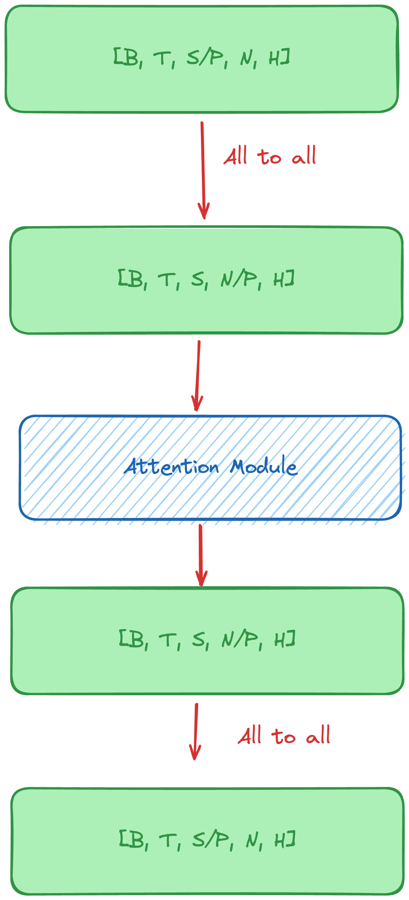

# Open-Sora 1.2 Report

- [Video compression network](#video-compression-network)
- [Rectified flow and model adaptation](#rectified-flow-and-model-adaptation)
- [More data and better multi-stage training](#more-data-and-better-multi-stage-training)
- [Easy and effective model conditioning](#easy-and-effective-model-conditioning)
- [Evaluation](#evaluation)
- [Sequence parallelism](#sequence-parallelism)

In Open-Sora 1.2 release, we train a 1.1B models on >30M data (\~80k hours), with training cost 35k H100 GPU hours, supporting 0s\~16s, 144p to 720p, various aspect ratios video generation. Our configurations is listed below. Following our 1.1 version, Open-Sora 1.2 can also do image-to-video generation and video extension.

|      | image | 2s  | 4s  | 8s  | 16s |
| ---- | ----- | --- | --- | --- | --- |
| 240p | ✅     | ✅   | ✅   | ✅   | ✅   |
| 360p | ✅     | ✅   | ✅   | ✅   | ✅   |
| 480p | ✅     | ✅   | ✅   | ✅   | 🆗   |
| 720p | ✅     | ✅   | ✅   | 🆗   | 🆗   |

Here ✅ means that the data is seen during training, and 🆗 means although not trained, the model can inference at that config. Inference for 🆗 requires more than one 80G memory GPU and sequence parallelism.

Besides features introduced in Open-Sora 1.1, Open-Sora 1.2 highlights:

- Video compression network
- Rectifie-flow training
- More data and better multi-stage training
- Easy and effective model conditioning
- Better evaluation metrics

All implementations (both training and inference) of the above improvements are available in the Open-Sora 1.2 release. The following sections will introduce the details of the improvements. We also refine our codebase and documentation to make it easier to use and develop, and add a LLM to [refine input prompts](/README.md#gpt-4o-prompt-refinement) and support more languages.

## Video compression network

For Open-Sora 1.0 & 1.1, we used stability-ai's 83M 2D VAE, which compress the video only in the spatial dimension by 8x8 times. To reduce the temporal dimension, we extracted one frame in every three frames. However, this method led to the low fluency of generated video as the generated fps is sacrificed. Thus, in this release, we introduce the video compression network as OpenAI's Sora does. With a 4 times compression in the temporal dimension, we do not need to extract frames and can generate videos with the original fps.

Considering the high computational cost of training a 3D VAE, we hope to re-use the knowledge learnt in the 2D VAE. We notice that after 2D VAE's compression, the features adjacent in the temporal dimension are still highly correlated. Thus, we propose a simple video compression network, which first compress the video in the spatial dimension by 8x8 times, then compress the video in the temporal dimension by 4x times. The network is shown below:


We initialize the 2D VAE with [SDXL's VAE](https://huggingface.co/stabilityai/sdxl-vae), which is better than our previously used one. For the 3D VAE, we adopt the structure of VAE in [Magvit-v2](https://magvit.cs.cmu.edu/v2/), which contains 300M parameters. Along with 83M 2D VAE, the total parameters of the video compression network is 384M. We train the 3D VAE for 1.2M steps with local batch size 1. The training data is videos from pixels and pixabay, and the training video size is mainly 17 frames, 256x256 resolution. Causal convolutions are used in the 3D VAE to make the image reconstruction more accurate.

Our training involves three stages:

1. For the first 380k steps, we train on 8 GPUs and freeze the 2D VAE. The training objective includes the reconstruction of the compressed features from 2D VAE (pink one in the figure) and also add a loss to make features from the 3D VAE similar to the features from the 2D VAE (pink one and green one, called identity loss). We find the latter loss can quickly make the whole VAE achieve a good performance for image and much faster to converge in the next stage.
2. For the next 260k steps, We remove the identity loss and just learn the 3D VAE.
3. For the last 540k steps , since we find only reconstruction 2D VAE's feature cannot lead to further improvement, we remove the loss and train the whole VAE to reconstruct the original videos. This stage is trained on on 24 GPUs.

For both stage 1 and stage 2 training, we adopt 20% images and 80% videos. Following [Magvit-v2](https://magvit.cs.cmu.edu/v2/), we train video using 17 frames, while zero-padding the first 16 frames for image. However, we find that this setting leads to blurring of videos with length different from 17 frames. Thus, in stage 3, we use a random number within 34 frames for mixed video length training (a.k.a., zero-pad the first  `43-n` frames if we want to train a `n` frame video), to make our VAE more robust to different video lengths. Our [training](/scripts/train_vae.py) and [inference](/scripts/inference_vae.py) code is available in the Open-Sora 1.2 release.

When using the VAE for diffusion model, our stacked VAE requires small memory as the our VAE's input is already compressed. We also split the input videos input several 17 frames clips to make the inference more efficient.  The performance of our VAE is on par with another open-sourced 3D VAE in [Open-Sora-Plan](https://github.com/PKU-YuanGroup/Open-Sora-Plan/blob/main/docs/Report-v1.1.0.md).

| Model              | SSIM↑ | PSNR↑  |
| ------------------ | ----- | ------ |
| Open-Sora-Plan 1.1 | 0.882 | 29.890 |
| Open-Sora 1.2      | 0.880 | 30.590 |

## Rectified flow and model adaptation

Lastest diffusion model like Stable Diffusion 3 adopts the [rectified flow](https://github.com/gnobitab/RectifiedFlow) instead of DDPM for better performance. Pitiably, SD3's rectified flow training code is not open-sourced. However, Open-Sora 1.2 provides the training code following SD3's paper, including:

- Basic rectified flow training ([original rectified flow paper](https://arxiv.org/abs/2209.03003))
- Logit-norm sampling for training acceleration ([SD3 paper](https://arxiv.org/pdf/2403.03206) Section 3.1, intuitively it is more likely to sample timesteps at middle noise level)
- Resolution and video length aware timestep sampling ([SD3 paper](https://arxiv.org/pdf/2403.03206) Section 5.3.2, intuitively it is more likely to sample timesteps with more noise for larger resolution, and we extend it to longer video)

For the resolution-aware timestep sampling, we should use more noise for images with larger resolution. We extend this idea to video generation and use more noise for videos with longer length.

Open-Sora 1.2 starts from the [PixArt-Σ 2K](https://github.com/PixArt-alpha/PixArt-sigma) checkpoint. Note that this model is trained with DDPM and SDXL VAE, also a much higher resolution. We find finetuning on a small dataset can easily adapt the model for our video generation setting. The adaptation process is as follows, all training is done on 8 GPUs (the adaptation for the diffusion model is quite fast and straightforward):

1. Multi-resolution image generation ability: we train the model to generate different resolution ranging from 144p to 2K for 20k steps.
2. QK-norm: we add the QK-norm to the model and train for 18k steps.
3. Rectified flow: we transform from discrete-time DDPM to continuous-time rectified flow and train for 10k steps.
4. Rectified flow with logit-norm sampling and resolution-aware timestep sampling: we train for 33k steps.
5. Smaller AdamW epsilon: following SD3, with QK-norm, we can use a smaller epsilon (1e-15) for AdamW, we train for 8k steps.
6. New VAE and fps conditioning: we replace the original VAE with ours and add fps conditioning to the timestep conditioning, we train for 25k steps. Note that normalizing each channel is important for rectified flow training.
7. Temporal attention blocks: we add temporal attention blocks with zero initialized projection layers. We train on images for 3k steps.
8. Temporal blocks only for video with mask strategy: we train the temporal attention blocks only on videos for 38k steps.

After the above adaptation, we are ready to train the model on videos. The adaptation above maintains the original model's ability to generate high-quality images, and brings multiple benefits for video generation:

- With rectified flow, we can accelerate the training and reduce the number of sampling steps for video from 100 to 30, which greatly reduces the waiting time for inference.
- With qk-norm, the training is more stablized and an aggressive optimizer can be used.
- With new VAE, the temporal dimension is compressed by 4 times, which makes the training more efficient.
- With multi-resolution image generation ability, the model can generate videos with different resolutions.

## More data and better multi-stage training

Due to a limited computational budget, we carefully arrange the training data from low to high quality and split our training into three stages. Our training involves 12x8 GPUs, and the total training time is about 2 weeks for about 70k steps.

### First stage

We first train the model on Webvid-10M datasets (40k hours) for 30k steps (2 epochs). Since the video is all lower than 360p resolution and contains watermark, we train on this dataset first. The training mainly happens on 240p and 360p, with video length 2s~16s. We use the original caption in the dataset for training. The training config locates in [stage1.py](/configs/opensora-v1-2/train/stage1.py).

### Second stage

Then we train the model on Panda-70M datasets. This dataset is large but the quality varies. We use the official 30M subset which clips are more diverse, and filter out videos with aesthetic score lower than 4.5. This leads to a 20M subset with 41k hours. The captions in the dataset are directly used for our training. The training config locates in [stage2.py](/configs/opensora-v1-2/train/stage2.py).

The training mainly happens on 360p and 480p. We train the model for 23k steps, which is 0.5 epoch. The training is not fully done since we hope our new model can meet you earlier.

### Third stage

In this stage, we collect ~2M video clips with a total length of 5K hours from all kinds of sources, including:

- Free-license videos, sourced from Pexels, Pixabay, Mixkit, etc.
- [MiraData](https://github.com/mira-space/MiraData): a high-quality dataset with long videos, mainly from games and city/scenic exploration.
- [Vript](https://github.com/mutonix/Vript/tree/main): a densely annotated dataset.
- And some other datasets.

While MiraData and Vript have captions from GPT, we use [PLLaVA](https://github.com/magic-research/PLLaVA) to caption the rest ones. Compared with LLaVA, which is only capable of single frame/image captioning, PLLaVA is specially designed and trained for video captioning. The [accelerated PLLaVA](/tools/caption/README.md#pllava-captioning) is released in our `tools/`. In practice, we use the pretrained PLLaVA 13B model and select 4 frames from each video for captioning with a spatial pooling shape of 2*2.

Some statistics of the video data used in this stage are shown below. We present basic statistics of duration and resolution, as well as aesthetic score and optical flow score distribution.
We also extract tags for objects and actions from video captions and count their frequencies.


We mainly train 720p and 1080p videos in this stage, aiming to extend the model's ability to larger resolutions. We use a mask ratio of 25% during training. The training config locates in [stage3.py](/configs/opensora-v1-2/train/stage3.py). We train the model for 15k steps, which is approximately 2 epochs.

## Easy and effective model conditioning

For stage 3, we calculate the aesthetic score and motion score for each video clip. However, since the number of video clips is small, we are not willing to filter out clips with low scores, which leads to a smaller dataset. Instead, we append the scores to the captions and use them as conditioning. We find this method can make model aware of the scores and follows the scores to generate videos with better quality.

For example, a video with aesthetic score 5.5, motion score 10, and a detected camera motion pan left, the caption will be:

```plaintext
[Original Caption] aesthetic score: 5.5, motion score: 10, camera motion: pan left.
```

During inference, we can also use the scores to condition the model. For camera motion, we only label 13k clips with high confidence, and the camera motion detection module is released in our tools.

## Evaluation

Previously, we monitor the training process only by human evaluation, as DDPM traning loss is not well correlated with the quality of generated videos. However, for rectified flow, we find the training loss is well correlated with the quality of generated videos as stated in SD3. Thus, we keep track of rectified flow evaluation loss on 100 images and 1k videos.

We sampled 1k videos from pixabay as validation dataset. We calculate the evaluation loss for image and different lengths of videos (2s, 4s, 8s, 16s) for different resolution (144p, 240p, 360p, 480p, 720p). For each setting, we equidistantly sample 10 timesteps. Then all the losses are averaged. We also provide a [video](https://streamable.com/oqkkf1) showing the sampled videos with a fixed prompt for different steps.


In addition, we also keep track of [VBench](https://vchitect.github.io/VBench-project/) scores during training. VBench is an automatic video evaluation benchmark for short video generation. We calcuate the vbench score with 240p 2s videos. The two metrics verify that our model continues to improve during training.


All the evaluation code is released in `eval` folder. Check the [README](/eval/README.md) for more details.

| Model          | Total Score | Quality Score | Semantic Score |
| -------------- | ----------- | ------------- | -------------- |
| Open-Sora V1.0 | 75.91%      | 78.81%        | 64.28%         |
| Open-Sora V1.2 | 79.23%      | 80.71%        | 73.30%         |

## Sequence parallelism

We use sequence parallelism to support long-sequence training and inference. Our implementation is based on Ulysses and the workflow is shown below. When sequence parallelism is enabled, we only need to apply the `all-to-all` communication to the spatial block in STDiT as only spatial computation is dependent on the sequence dimension.



Currently, we have not used sequence parallelism for training as data resolution is small and we plan to do so in the next release. As for inference, we can use sequence parallelism in case your GPU goes out of memory. A simple benchmark shows that sequence parallelism can achieve speedup

| Resolution | Seconds | Number of GPUs | Enable SP | Time taken/s | Speedup per GPU |
| ---------- | ------- | -------------- | --------- | ------------ | --------------- |
| 720p       | 16s     | 1              | No        | 547.97       | -               |
| 720p       | 16s     | 2              | Yes       | 244.38       | 12%             |
