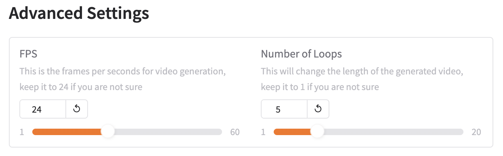

# 🕹 Gradio Demo

We have provided a Gradio demo app for you to generate videos via a web interface. You can choose to run it locally or deploy it to Hugging Face by following the instructions given below.

## 🚀 Run Gradio Locally (Outdated)

We assume that you have already installed `opensora` based on the instructions given in the [main README](../README.md). Follow the steps below to run this app on your local machine.

1. First of all, you need to install `gradio` and `spaces`.

```bash
pip install gradio spaces
```

2. Afterwards, you can use the following command to launch the application. Remember to launch the command in the project root directory instead of the `gradio` folder.

```bash
# start the gradio app
python gradio/app.py

# run with a different port
python gradio/app.py --port 8000

# run with acceleration such as flash attention and fused norm
python gradio/app.py --enable-optimization

# run with a sharable Gradio link
python gradio/app.py --share
```

3. You should then be able to access this demo via the link which appears in your terminal.

## 📦 Deploy Gradio to Hugging Face Space (Outdated)

We have also tested this Gradio app on Hugging Face Spaces. You can follow the steps below.

1. Create a Space on Hugging Face, remember to choose `Gradio SDK` and GPU space hardware.

2. Clone the Space repository in your local machine.

3. Copy the `configs` folder and `gradio/app.py` and `gradio/requirements.txt` to the repository you just cloned. The file structure will look like:

```text
- configs
    - ...
- app.py
- requirements.txt
- README.md
- LICENSE
- ...
```

4. Push the files to your remote Hugging Face Spaces repository. The application will be built and run automatically.

## Advanced Usage



For the "**FPS**" option, as now we fix the output video's FPS to 24, this option will not affect the output video's length. Thus, for a smaller FPS, the video is supposed to be longer but accelerated due to 24 FPS. Thus, the video will be less smooth but faster. For a larger FPS, the video will be smoother but slower.

For the "**Number of Loops**", it will affect the output video's length and generation speed. For example, if you set the number of loops to 2, the output video will be twice as long as the original video. This is achieved by conditioning the next generation on 1/4 of the previous generated frames and then concatenating all the frames together.

A trick to give different text prompts for different parts of the video is to use the `|x|` symbol to separate the text prompts, where x is the start frame of the next text prompt. This format requires a `|0|` at the start of the prompt. For example, if you want to generate a video with the text prompt "A cat" for the first 2 generations and "A dog" for the rest generations, you can use the text prompt "|0|A cat|2|A dog". You can still check the "**Enhance prompt with GPT4o**" to refine your prompts in each part separately.
